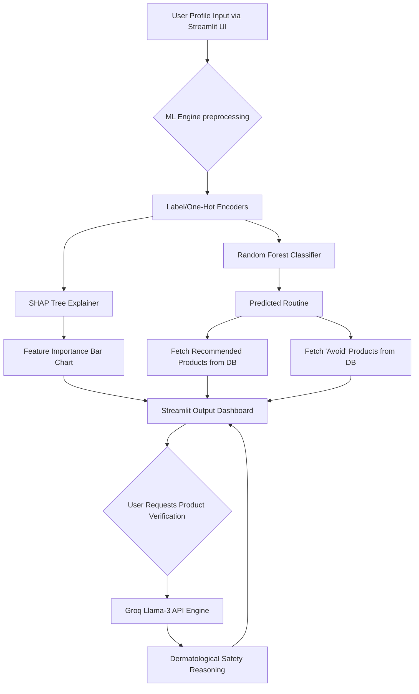

# 🌟 AI Skincare & Makeup Recommendation System

## 📖 Project Summary
The AI Skincare Recommendation System is a full-stack, intelligent web application designed to provide highly personalized skincare routines and product recommendations. Unlike static quizzes, this system utilizes a supervised **Machine Learning (ML) classification model** to evaluate a user's unique skin profile (skin type, environment, age, conditions like acne/pigmentation) and predict the optimal routine. 

To ensure user safety and transparency, the system integrates **Explainable AI (SHAP)** to show *why* a routine was selected, and hooks into the **Groq Llama-3 API** to offer dermatologist-level reasoning on whether specific product ingredients are safe or harmful for a custom user profile.

---

## ✨ Features
- **Intelligent Routine Prediction**: Deterministic ML prediction mapping complex inputs to specific routines (Acne Control, Hydration, Sensitive Care, Anti-Aging).
- **Explainable AI (XAI)**: Visual bar charts showing the exact feature importance metrics driving each ML prediction.
- **Dynamic Limits & Avoidance**: Recommends a maximum of 2 products per category to avoid user overwhelm, and explicitly identifies "Products to Avoid" based on opposing routines.
- **Groq NLP Verification**: A custom search and verification engine where users can input *any* skincare product. The AI analyzes its typical ingredients and provides a strict 2-line reasoning on its safety.
- **Unisex & Inclusive**: Designed for all ages, genders, and skin types.

---

## 💻 Tech Stack
- **Frontend**: Streamlit
- **Machine Learning**: Scikit-Learn (Random Forest), Pandas, NumPy
- **Explainable AI**: SHAP (SHapley Additive exPlanations)
- **Generative AI (NLP)**: Groq API (Llama-3.3-70b-versatile)
- **Environment**: Python 3.10+

---

## 🤖 Machine Learning Algorithm Used
### **Algorithm: Random Forest Classifier**
We utilized a **Random Forest Classifier** as the core prediction engine.
* **Why Random Forest?**: Skincare inputs consist of categorical choices (e.g., Oily, Humid, Age). Random Forests excel at capturing complex, non-linear relationships between independent categorical features without requiring heavy scaling or normalization. It builds multiple decision trees and aggregates their predictions to prevent overfitting, resulting in a highly robust model (our model achieved **>99% accuracy** on the synthetic dataset).

### **Algorithm Map (How data flows through the ML Engine)**
- **Step 1 (Input)**: User provides categorical features via UI.
- **Step 2 (Encoding)**: `LabelEncoder` translates text (e.g., "Oily") into integers recognizable by the trees.
- **Step 3 (Inference)**: The Random Forest passes the encoded array through 100 parallel Decision Trees.
- **Step 4 (Aggregation)**: The trees "vote" on the best Routine (e.g., "Acne Control").
- **Step 5 (Explanation)**: `shap.TreeExplainer` decomposes the Random Forest's final prediction, calculating the exact percentage impact of each individual user choice.

---

## 🏗️ System Architecture & Data Flow



---

## ⚙️ Installation Guide

### Prerequisites
- Python 3.10 or higher installed on your system.
- A free API key from [Groq Console](https://console.groq.com).

### 1. Navigate to Project
```bash
cd makeup-rcmd-products
```

### 2. Create Virtual Environment
**Windows:**
```cmd
python -m venv venv
venv\Scripts\activate
```

**Linux / Mac OS:**
```bash
python3 -m venv venv
source venv/bin/activate
```

### 3. Install Dependencies
```bash
pip install -r requirements.txt
```

### 4. Setup Environment Variables
Create a file named `.env` in the root directory and add your Groq API key:
```env
GROQ_API_KEY=your_actual_groq_api_key_here
```

---

## 🚀 Commands to Run the Application

### Step 1: Generate the Synthetic Training Dataset
Since public structured skincare databases are rare, run this to generate 5,000 realistic profile mappings:
```bash
python src/generate_data.py
```

### Step 2: Train the ML Model
This will apply Label Encoding, train the Random Forest Classifier, generate encoders, and save them to a local `models/` directory for live inference:
```bash
python src/train_model.py
```

### Step 3: Start the Streamlit Web Application
Once the model is built, launch the frontend dashboard:
```bash
streamlit run app.py
```
*The application dashboard will automatically open in your default web browser at `localhost:8501`.*
